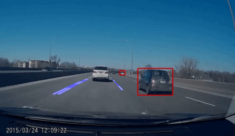

# Self-Driving-Detection
Self-Driving-Detection project uses a R-CNN detectors with ResNet-50 Tensorflow model to detect cars, people, stop signs.
Also it detects highway road lanes by computer vision, which differentiates the color differences in desired region through multiple techniques like color transformation, Hough transformation, Canny edge detection, etc. 
Also, multiprocessing is implemented to allow it to run on CPU efficiently.
## Example


## Installation
- python 2.7
- numpy
- Tensorflow
- openCV

Then run ```python self_drive.py``` locally

## Notes
You can specify the video file name under self_drive.py, it should be stored in the same directory. Also, the region of interest might need being adjusted depending on the position of views that the dash cam takes, it can be modifyed in LaneDetection.py.
